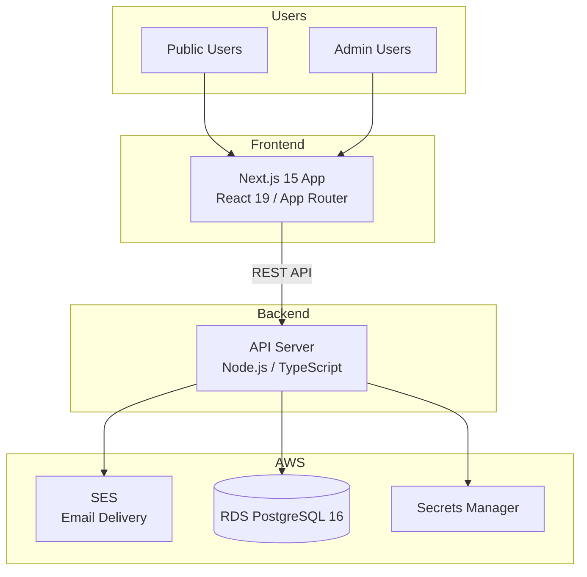
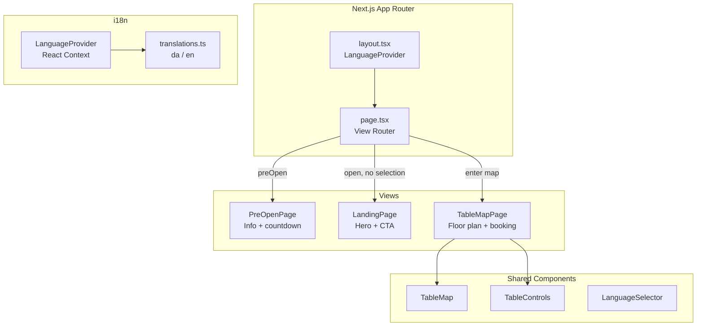
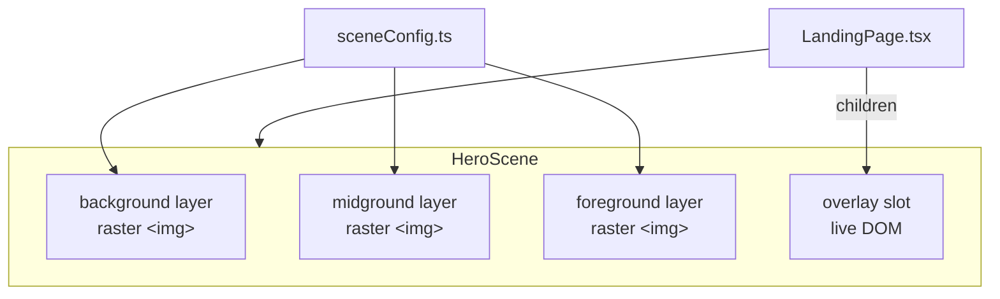
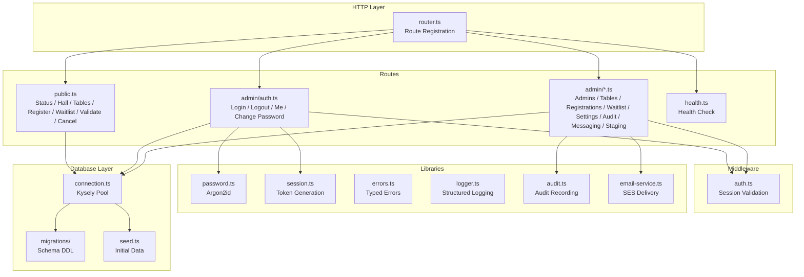
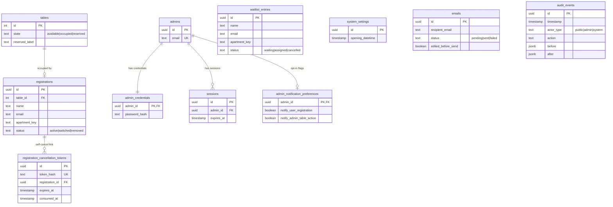
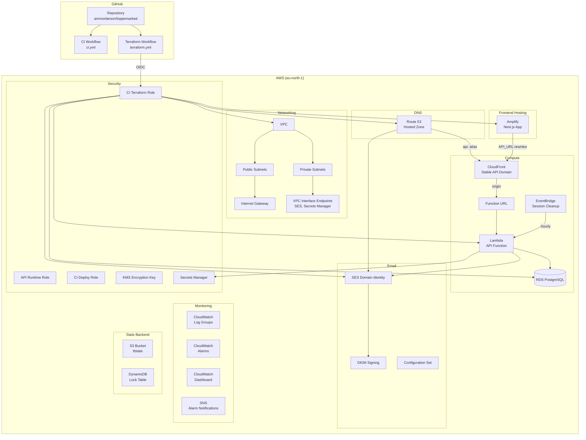
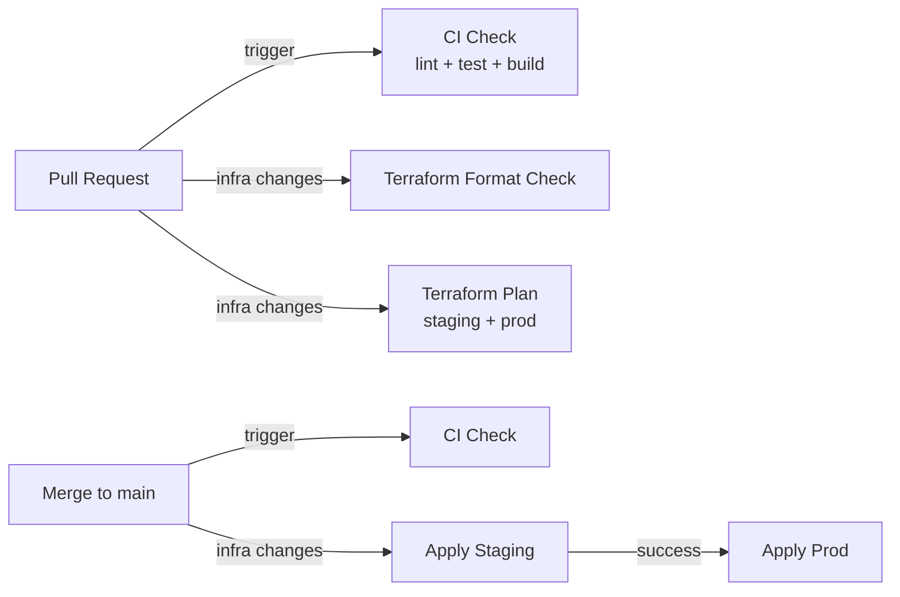

# UN17 Village Loppemarked Architecture

## System Overview

UN17 Village Loppemarked is a bilingual (Danish/English) booking platform that allows UN17 Village residents to register for flea-market tables in the Fælledhuset community hall. The system serves public users (no authentication) and admin users (email/password authentication).



## Frontend Architecture

The frontend is a Next.js 15 application using the App Router with React 19. It uses inline styles and a custom i18n system based on React context.



### View Routing

The app uses state-driven view switching (not URL routing):

1. **Pre-open mode** — When current time < opening datetime, show `PreOpenPage`.
2. **Landing** — After opening, show `LandingPage` with the hero scene and entry CTA.
3. **Map view** — On entry, show `TableMapPage` with the Fælledhuset floor plan and booking detail panel.

### i18n

Language detection follows this priority:
1. Browser locale (`navigator.language`)
2. Manual user selection via `LanguageSelector`

The `LanguageProvider` React context makes the current language and `t()` translation function available to all components. Translation strings are defined in `translations.ts` with key contracts in `@loppemarked/shared`.

### Landing-Page Layered Hero

The public landing page renders its hero as a layered composition rather than a single inline SVG. This keeps the page rendering strategy compatible with photorealistic, composited flea-market imagery and lets final assets land without structural rewrites.

The architecture has two pieces:

- `components/HeroScene.tsx` — a generic primitive that stacks up to three raster `` layers around a live-DOM overlay slot. `background` and `midground` sit behind the overlay; `foreground` composites on top of it so props read like objects in front of the scene. Each layer is optional and accepts either a `src` or a `placeholder` node. Layers have `pointer-events: none`, so interactive overlay content stays clickable through transparent parts of the foreground asset.
- `components/landing/sceneConfig.ts` — a data file that names the landing hero's asset slots. Swapping or adding an asset is a config edit, not a component change.



The overlay currently hosts the eyebrow, H1, body copy, and primary CTA. Because the overlay is plain DOM, i18n, hover states, and focus management all work as usual.

#### Landing-Page Asset Pack

Raster assets consumed by the landing-page scene live in `apps/web/public/landing/`. The pipeline is deliberately boring: drop a file, reference it from `sceneConfig.ts` or `landing.css`, ship.

File-naming convention: `landing-<role>[-<variant>].<ext>`. Today the pack includes:

- `landing-hero-desktop.webp` — wide-crop hero backdrop for viewports above the mobile breakpoint.
- `landing-hero-mobile.webp` — portrait-crop hero backdrop for `max-width: 760px` viewports.

Art direction between the desktop and mobile hero crops runs through the `<picture>` element: `SceneAsset.sources` accepts a list of `{ srcSet, media, type }` entries that `HeroScene` renders as `<source>` children, with `src` acting as the fallback for browsers that skip `<picture>`. The mobile media query lives in `LANDING_MOBILE_MEDIA_QUERY` in `sceneConfig.ts` to keep the CSS breakpoint and the art-direction breakpoint aligned. Sizing: keep desktop crops ≥ 2400px wide and mobile crops ≥ 1400px wide, and export as WebP to stay under a few hundred KB per asset.

## Backend Architecture

The API is a Node.js/TypeScript application using Kysely as a type-safe PostgreSQL query builder.



### API Surface

| Method | Path                                          | Auth   | Description                                       |
|--------|-----------------------------------------------|--------|---------------------------------------------------|
| GET    | `/health`                                     | None   | Health check                                      |
| GET    | `/public/status`                              | None   | Registration open/closed status                   |
| GET    | `/public/hall`                                | None   | Aggregate hall availability counts                |
| GET    | `/public/tables`                              | None   | Public-safe table states                          |
| POST   | `/public/validate-address`                    | None   | Address eligibility check                         |
| POST   | `/public/validate-registration`               | None   | Full registration input validation                |
| POST   | `/public/register`                            | None   | Register for a flea-market table                  |
| POST   | `/public/waitlist`                            | None   | Join waitlist                                     |
| GET    | `/public/waitlist/position/:apartmentKey`     | None   | Waitlist position lookup for an apartment         |
| GET    | `/public/cancel/:token`                       | None   | Self-cancel magic-link details                    |
| POST   | `/public/cancel/:token`                       | None   | Confirm self-cancel via magic link                |
| POST   | `/admin/auth/login`                           | None   | Admin login                                       |
| GET    | `/admin/auth/me`                              | Admin  | Current admin session                             |
| POST   | `/admin/auth/logout`                          | Admin  | Log out current admin                             |
| POST   | `/admin/auth/change-password`                 | Admin  | Change own password                               |
| GET    | `/admin/admins`                               | Admin  | List admin accounts                               |
| POST   | `/admin/admins`                               | Admin  | Create admin account                              |
| DELETE | `/admin/admins/:id`                           | Admin  | Delete admin account                              |
| GET    | `/admin/tables`                               | Admin  | List tables with admin metadata                   |
| POST   | `/admin/tables/reserve`                       | Admin  | Mark a table reserved                             |
| POST   | `/admin/tables/release`                       | Admin  | Release a reserved table                          |
| GET    | `/admin/registrations`                        | Admin  | List all registrations                            |
| POST   | `/admin/registrations`                        | Admin  | Create override reservation                       |
| POST   | `/admin/registrations/move`                   | Admin  | Move registration between tables                  |
| POST   | `/admin/registrations/remove`                 | Admin  | Remove registration                               |
| GET    | `/admin/waitlist`                             | Admin  | List waitlist entries                             |
| POST   | `/admin/waitlist/assign`                      | Admin  | Assign waitlist entry to a table                  |
| DELETE | `/admin/waitlist/:id`                         | Admin  | Remove a waitlist entry                           |
| POST   | `/admin/notifications/preview`                | Admin  | Preview a per-action admin notification email     |
| POST   | `/admin/messaging/template`                   | Admin  | Fetch bulk-email template                         |
| POST   | `/admin/messaging/preview`                    | Admin  | Preview bulk email                                |
| POST   | `/admin/messaging/recipients`                 | Admin  | List recipients for a bulk send                   |
| POST   | `/admin/messaging/send`                       | Admin  | Send bulk email                                   |
| POST   | `/admin/audit-events`                         | Admin  | Retrieve filtered audit timeline                  |
| GET    | `/admin/settings/opening-time`                | Admin  | Get current opening datetime                      |
| PATCH  | `/admin/settings/opening-time`                | Admin  | Update opening datetime                           |
| GET    | `/admin/settings/notification-preferences`    | Admin  | Get notification opt-in flags for current admin   |
| PATCH  | `/admin/settings/notification-preferences`    | Admin  | Update notification opt-in flags                  |
| POST   | `/admin/staging/fill-tables`                  | Admin  | (Staging only) Fill all tables with test bookings |
| POST   | `/admin/staging/clear-registrations`          | Admin  | (Staging only) Clear all registrations            |

## Database Architecture

PostgreSQL 16 with the core tables below. The schema is created from a single Kysely baseline migration; future schema changes ship as additional migrations on top of it.



### Key Constraints

- **One active occupant per table** — Partial unique index on `table_id` where `status = 'active'`.
- **Table id catalog** — Check constraint limits `tables.id` to the visible Fælledhuset catalog (contiguous 1–24).
- **Immutable audit trail** — Database trigger prevents UPDATE/DELETE on `audit_events`.
- **Table states** — Enum constraint: `available`, `occupied`, `reserved`.
- **FIFO waitlist** — Ordered by `created_at`; duplicate apartment preserves earliest timestamp.

## Infrastructure Architecture

All AWS infrastructure is managed via Terraform with isolated staging and production environments.



### Environments

| Environment | Domain                | VPC CIDR       | RDS Instance    |
|-------------|----------------------|----------------|-----------------|
| staging     | `staging.un17hub.com`| `10.2.0.0/16`  | `db.t4g.micro`  |
| prod        | `un17hub.com`        | `10.1.0.0/16`  | `db.t4g.small`  |

### Terraform Module Structure

```
infra/terraform/
├── bootstrap/                 One-time state backend setup
│   ├── main.tf
│   └── variables.tf
├── environments/
│   ├── staging/main.tf        Staging stack configuration
│   └── prod/main.tf           Production stack + subdomain delegation
└── modules/
    └── loppemarked_stack/      Shared module for all AWS resources
        ├── main.tf            Naming prefix, provider config
        ├── amplify.tf         Amplify app, branch, and domain association
        ├── api_runtime.tf     Lambda function, Function URL, EventBridge schedule
        ├── api_domain.tf      Stable API domain: ACM cert, CloudFront, Route 53 alias
        ├── database.tf        RDS, Secrets Manager
        ├── dns.tf             Route 53 zone and records
        ├── iam.tf             IAM roles and policies
        ├── monitoring.tf      CloudWatch, KMS, Alarms, Dashboard, SNS
        ├── networking.tf      VPC, subnets, gateways
        ├── outputs.tf         Module outputs
        ├── ses.tf             SES identity, DKIM, config set
        ├── variables.tf       Input variables
        └── iam.tftest.hcl     Least-privilege IAM validation tests
```

### CI/CD Pipeline



- **CI** runs on every PR: lint, test, build for all workspaces; `terraform fmt` + `terraform validate`.
- **Terraform** runs when `infra/terraform/**` changes: format check + plan on PRs, apply on merge to main. The `Format Check` job enforces `terraform fmt -check -recursive` and blocks merge when formatting is invalid.
- **Deploy API** (`deploy.yml`) runs on push to `main` when `apps/api/**` or `packages/shared/**` change: builds the Lambda bundle, deploys to staging with a health smoke test, then promotes to production.
- **Deploy Web** (`deploy-web.yml`) runs on push to `main` when `apps/web/**` or `packages/shared/**` change: triggers an Amplify production release job and waits for build completion.
- **Drift detection** runs daily via `drift-detection.yml`; creates a GitHub issue if drift is found.
- **Session cleanup** runs hourly via an EventBridge scheduled rule that invokes the API Lambda. The handler detects the scheduled event and deletes expired sessions (8-hour TTL) from the database.
- **Production apply** runs automatically after staging succeeds.
- **AWS auth** uses GitHub OIDC role assumption (no long-lived keys).

## Shared Package

The `@loppemarked/shared` package contains code used by both frontend and backend:

- **Domain constants** — Fælledhuset table catalog, opening datetime, email config, clothing-rack adjacency.
- **Types** — Interfaces for all entities (`TablePublic`, `Table`, `Registration`, etc.).
- **Validators** — Address, email, name, and table-id validation with typed results.
- **DAWA** — Danish Address Web API types and helpers for address autocomplete.
- **i18n contracts** — Translation key definitions and language labels.
- **Enums** — Table states, registration statuses, audit actions.
